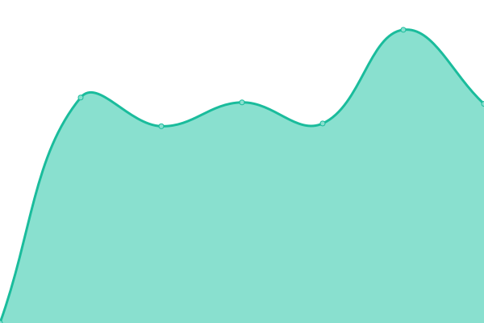
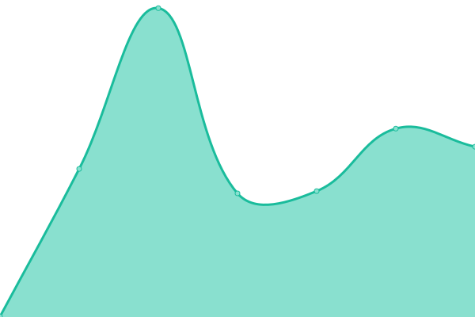
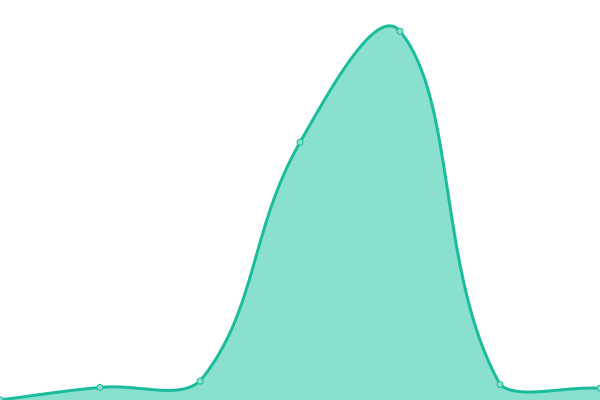
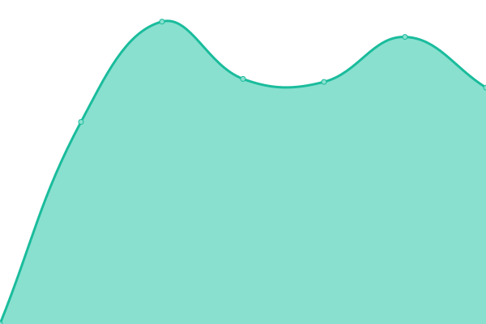
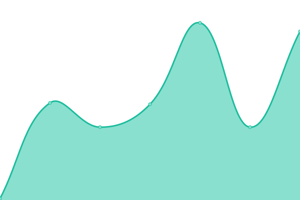
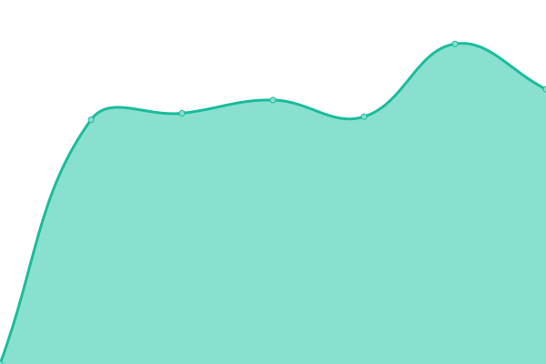
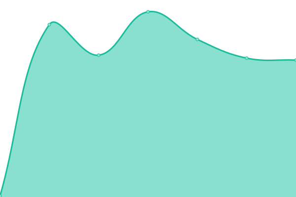

# [📈 Live Status](https://JustinTzeJi.github.io/uptimes): <!--live status--> **🟧 Partial outage**

This repository contains the open-source uptime monitor and status page for [Justin Koay](www.iwa.my), powered by [Upptime](https://github.com/upptime/upptime).

With [Upptime](https://upptime.js.org), you can get your own unlimited and free uptime monitor and status page, powered entirely by a GitHub repository. We use [Issues](https://github.com/JustinTzeJi/uptimes/issues) as incident reports, [Actions](https://github.com/JustinTzeJi/uptimes/actions) as uptime monitors, and [Pages](https://JustinTzeJi.github.io/uptimes) for the status page.

<!--start: status pages-->
<!-- This summary is generated by Upptime (https://github.com/upptime/upptime) -->
<!-- Do not edit this manually, your changes will be overwritten -->
<!-- prettier-ignore -->
| URL | Status | History | Response Time | Uptime |
| --- | ------ | ------- | ------------- | ------ |
|  [Pejabat Perdana Menteri](https://www.pmo.gov.my/) | 🟩 Up | [pejabat-perdana-menteri.yml](https://github.com/JustinTzeJi/uptimes/commits/HEAD/history/pejabat-perdana-menteri.yml) | 

 2557ms
     
 | 

<a href="https://JustinTzeJi.github.io/uptimes/history/pejabat-perdana-menteri">99.04%</a>
    

|  [Kementerian Kewangan](https://mof.gov.my/portal/ms/) | 🟩 Up | [kementerian-kewangan.yml](https://github.com/JustinTzeJi/uptimes/commits/HEAD/history/kementerian-kewangan.yml) | 

 2133ms
     
 | 

<a href="https://JustinTzeJi.github.io/uptimes/history/kementerian-kewangan">99.33%</a>
    

|  [Kementerian Ekonomi](https://www.ekonomi.gov.my/) | 🟩 Up | [kementerian-ekonomi.yml](https://github.com/JustinTzeJi/uptimes/commits/HEAD/history/kementerian-ekonomi.yml) | 

 4836ms
     
 | 

<a href="https://JustinTzeJi.github.io/uptimes/history/kementerian-ekonomi">99.33%</a>
    

|  [Kementerian Pertahanan](https://www.mod.gov.my/) | 🟩 Up | [kementerian-pertahanan.yml](https://github.com/JustinTzeJi/uptimes/commits/HEAD/history/kementerian-pertahanan.yml) | 

 583ms
     
 | 

<a href="https://JustinTzeJi.github.io/uptimes/history/kementerian-pertahanan">100.00%</a>
    

|  [Kementerian Dalam Negeri](https://www.moha.gov.my/utama/index.php/ms) | 🟩 Up | [kementerian-dalam-negeri.yml](https://github.com/JustinTzeJi/uptimes/commits/HEAD/history/kementerian-dalam-negeri.yml) | 

 3032ms
     
 | 

<a href="https://JustinTzeJi.github.io/uptimes/history/kementerian-dalam-negeri">98.20%</a>
    

|  [Kementerian Luar Negeri](https://www.kln.gov.my/) | 🟩 Up | [kementerian-luar-negeri.yml](https://github.com/JustinTzeJi/uptimes/commits/HEAD/history/kementerian-luar-negeri.yml) | 

 300ms
     
 | 

<a href="https://JustinTzeJi.github.io/uptimes/history/kementerian-luar-negeri">100.00%</a>
    

|  [Kementerian Pelaburan, Perdagangan dan Industri](https://www.miti.gov.my/index.php) | 🟩 Up | [kementerian-pelaburan-perdagangan-dan-industri.yml](https://github.com/JustinTzeJi/uptimes/commits/HEAD/history/kementerian-pelaburan-perdagangan-dan-industri.yml) | 

 735ms
     
 | 

<a href="https://JustinTzeJi.github.io/uptimes/history/kementerian-pelaburan-perdagangan-dan-industri">100.00%</a>
    

|  [Kementerian Perdagangan Dalam Negeri dan Kos Sara Hidup](https://www.kpdn.gov.my/) | 🟩 Up | [kementerian-perdagangan-dalam-negeri-dan-kos-sara-hidup.yml](https://github.com/JustinTzeJi/uptimes/commits/HEAD/history/kementerian-perdagangan-dalam-negeri-dan-kos-sara-hidup.yml) | 

 2745ms
     
 | 

<a href="https://JustinTzeJi.github.io/uptimes/history/kementerian-perdagangan-dalam-negeri-dan-kos-sara-hidup">100.00%</a>
    

|  [Kementerian Sains, Teknologi dan Inovasi](https://www.mosti.gov.my/) | 🟩 Up | [kementerian-sains-teknologi-dan-inovasi.yml](https://github.com/JustinTzeJi/uptimes/commits/HEAD/history/kementerian-sains-teknologi-dan-inovasi.yml) | 

 2844ms
     
 | 

<a href="https://JustinTzeJi.github.io/uptimes/history/kementerian-sains-teknologi-dan-inovasi">99.33%</a>
    

|  [Kementerian Digital](https://www.digital.gov.my/) | 🟩 Up | [kementerian-digital.yml](https://github.com/JustinTzeJi/uptimes/commits/HEAD/history/kementerian-digital.yml) | 

 460ms
     
 | 

<a href="https://JustinTzeJi.github.io/uptimes/history/kementerian-digital">100.00%</a>
    

|  [Kementerian Pendidikan](https://www.moe.gov.my/) | 🟩 Up | [kementerian-pendidikan.yml](https://github.com/JustinTzeJi/uptimes/commits/HEAD/history/kementerian-pendidikan.yml) | 

 1236ms
     
 | 

<a href="https://JustinTzeJi.github.io/uptimes/history/kementerian-pendidikan">100.00%</a>
    

|  [Kementerian Pengajian Tinggi](https://www.mohe.gov.my/) | 🟩 Up | [kementerian-pengajian-tinggi.yml](https://github.com/JustinTzeJi/uptimes/commits/HEAD/history/kementerian-pengajian-tinggi.yml) | 

 1177ms
     
 | 

<a href="https://JustinTzeJi.github.io/uptimes/history/kementerian-pengajian-tinggi">100.00%</a>
    

|  [Kementerian Kesihatan](https://moh.gov.my/) | 🟥 Down | [kementerian-kesihatan.yml](https://github.com/JustinTzeJi/uptimes/commits/HEAD/history/kementerian-kesihatan.yml) | 

 4860ms
     
 | 

<a href="https://JustinTzeJi.github.io/uptimes/history/kementerian-kesihatan">99.98%</a>
    

|  [Kementerian Sumber Manusia](https://www.mohr.gov.my/) | 🟩 Up | [kementerian-sumber-manusia.yml](https://github.com/JustinTzeJi/uptimes/commits/HEAD/history/kementerian-sumber-manusia.yml) | 

 2564ms
     
 | 

<a href="https://JustinTzeJi.github.io/uptimes/history/kementerian-sumber-manusia">99.33%</a>
    

|  [Kementerian Pembangunan Usahawan dan Koperasi](https://www.kuskop.gov.my/) | 🟩 Up | [kementerian-pembangunan-usahawan-dan-koperasi.yml](https://github.com/JustinTzeJi/uptimes/commits/HEAD/history/kementerian-pembangunan-usahawan-dan-koperasi.yml) | 

 562ms
     
 | 

<a href="https://JustinTzeJi.github.io/uptimes/history/kementerian-pembangunan-usahawan-dan-koperasi">100.00%</a>
    

|  [Kementerian Pembangunan Wanita, Keluarga dan Masyarakat](https://www.kpwkm.gov.my/) | 🟩 Up | [kementerian-pembangunan-wanita-keluarga-dan-masyarakat.yml](https://github.com/JustinTzeJi/uptimes/commits/HEAD/history/kementerian-pembangunan-wanita-keluarga-dan-masyarakat.yml) | 

 3954ms
     
 | 

<a href="https://JustinTzeJi.github.io/uptimes/history/kementerian-pembangunan-wanita-keluarga-dan-masyarakat">100.00%</a>
    

|  [Kementerian Pertanian dan Kesejahteraan Makanan](https://www.kpkm.gov.my/bm/utama) | 🟩 Up | [kementerian-pertanian-dan-kesejahteraan-makanan.yml](https://github.com/JustinTzeJi/uptimes/commits/HEAD/history/kementerian-pertanian-dan-kesejahteraan-makanan.yml) | 

 3393ms
     
 | 

<a href="https://JustinTzeJi.github.io/uptimes/history/kementerian-pertanian-dan-kesejahteraan-makanan">99.33%</a>
    

|  [Kementerian Peralihan Tenaga dan Transformasi Air](https://www.petra.gov.my/) | 🟩 Up | [kementerian-peralihan-tenaga-dan-transformasi-air.yml](https://github.com/JustinTzeJi/uptimes/commits/HEAD/history/kementerian-peralihan-tenaga-dan-transformasi-air.yml) | 

 2150ms
     
 | 

<a href="https://JustinTzeJi.github.io/uptimes/history/kementerian-peralihan-tenaga-dan-transformasi-air">100.00%</a>
    

|  [Kementerian Sumber Asli dan Alam Sekitar](https://www.nres.gov.my/) | 🟩 Up | [kementerian-sumber-asli-dan-alam-sekitar.yml](https://github.com/JustinTzeJi/uptimes/commits/HEAD/history/kementerian-sumber-asli-dan-alam-sekitar.yml) | 

 2145ms
     
 | 

<a href="https://JustinTzeJi.github.io/uptimes/history/kementerian-sumber-asli-dan-alam-sekitar">100.00%</a>
    

|  [Kementerian Perladangan dan Komoditi](https://www.mpic.gov.my/) | 🟩 Up | [kementerian-perladangan-dan-komoditi.yml](https://github.com/JustinTzeJi/uptimes/commits/HEAD/history/kementerian-perladangan-dan-komoditi.yml) | 

 192ms
     
 | 

<a href="https://JustinTzeJi.github.io/uptimes/history/kementerian-perladangan-dan-komoditi">100.00%</a>
    

|  [Kementerian Pengangkutan](https://www.mot.gov.my/) | 🟩 Up | [kementerian-pengangkutan.yml](https://github.com/JustinTzeJi/uptimes/commits/HEAD/history/kementerian-pengangkutan.yml) | 

 2291ms
     
 | 

<a href="https://JustinTzeJi.github.io/uptimes/history/kementerian-pengangkutan">99.33%</a>
    

|  [Kementerian Kerja Raya](https://www.kkr.gov.my/ms/laman-utama) | 🟩 Up | [kementerian-kerja-raya.yml](https://github.com/JustinTzeJi/uptimes/commits/HEAD/history/kementerian-kerja-raya.yml) | 

 5654ms
     
 | 

<a href="https://JustinTzeJi.github.io/uptimes/history/kementerian-kerja-raya">99.54%</a>
    

|  [Kementerian Perumahan dan Kerajaan Tempatan](https://www.kpkt.gov.my/) | 🟩 Up | [kementerian-perumahan-dan-kerajaan-tempatan.yml](https://github.com/JustinTzeJi/uptimes/commits/HEAD/history/kementerian-perumahan-dan-kerajaan-tempatan.yml) | 

 4597ms
     
 | 

<a href="https://JustinTzeJi.github.io/uptimes/history/kementerian-perumahan-dan-kerajaan-tempatan">99.33%</a>
    

|  [Kementerian Pembangunan Luar Bandar](https://www.rurallink.gov.my/) | 🟩 Up | [kementerian-pembangunan-luar-bandar.yml](https://github.com/JustinTzeJi/uptimes/commits/HEAD/history/kementerian-pembangunan-luar-bandar.yml) | 

 2371ms
     
 | 

<a href="https://JustinTzeJi.github.io/uptimes/history/kementerian-pembangunan-luar-bandar">100.00%</a>
    

|  [Kementerian Wilayah Persekutuan](https://www.jwp.gov.my/) | 🟩 Up | [kementerian-wilayah-persekutuan.yml](https://github.com/JustinTzeJi/uptimes/commits/HEAD/history/kementerian-wilayah-persekutuan.yml) | 

 2952ms
     
 | 

<a href="https://JustinTzeJi.github.io/uptimes/history/kementerian-wilayah-persekutuan">100.00%</a>
    

|  [Kementerian Pelancongan, Seni dan Budaya](https://www.motac.gov.my/) | 🟩 Up | [kementerian-pelancongan-seni-dan-budaya.yml](https://github.com/JustinTzeJi/uptimes/commits/HEAD/history/kementerian-pelancongan-seni-dan-budaya.yml) | 

 5148ms
     
 | 

<a href="https://JustinTzeJi.github.io/uptimes/history/kementerian-pelancongan-seni-dan-budaya">99.33%</a>
    

|  [Kementerian Belia dan Sukan](https://www.kbs.gov.my/home) | 🟩 Up | [kementerian-belia-dan-sukan.yml](https://github.com/JustinTzeJi/uptimes/commits/HEAD/history/kementerian-belia-dan-sukan.yml) | 

 1495ms
     
 | 

<a href="https://JustinTzeJi.github.io/uptimes/history/kementerian-belia-dan-sukan">100.00%</a>
    

|  [Kementerian Perpaduan Negara](https://www.perpaduan.gov.my/) | 🟩 Up | [kementerian-perpaduan-negara.yml](https://github.com/JustinTzeJi/uptimes/commits/HEAD/history/kementerian-perpaduan-negara.yml) | 

 4227ms
     
 | 

<a href="https://JustinTzeJi.github.io/uptimes/history/kementerian-perpaduan-negara">100.00%</a>
    

|  [Kementerian Komunikasi](https://www.komunikasi.gov.my/) | 🟩 Up | [kementerian-komunikasi.yml](https://github.com/JustinTzeJi/uptimes/commits/HEAD/history/kementerian-komunikasi.yml) | 

 1616ms
     
 | 

<a href="https://JustinTzeJi.github.io/uptimes/history/kementerian-komunikasi">99.33%</a>
    

|  [Belanjawan](https://belanjawan.mof.gov.my/) | 🟩 Up | [belanjawan.yml](https://github.com/JustinTzeJi/uptimes/commits/HEAD/history/belanjawan.yml) | 

 3027ms
     
 | 

<a href="https://JustinTzeJi.github.io/uptimes/history/belanjawan">99.33%</a>
    

|  [InfoBanjir](https://publicinfobanjir.water.gov.my/?lang=en) | 🟩 Up | [info-banjir.yml](https://github.com/JustinTzeJi/uptimes/commits/HEAD/history/info-banjir.yml) | 

 652ms
     
 | 

<a href="https://JustinTzeJi.github.io/uptimes/history/info-banjir">100.00%</a>
    

|  [MYDS - Malaysia Government Design System](https://design.digital.gov.my/) | 🟩 Up | [myds-malaysia-government-design-system.yml](https://github.com/JustinTzeJi/uptimes/commits/HEAD/history/myds-malaysia-government-design-system.yml) | 

 157ms
     
 | 

<a href="https://JustinTzeJi.github.io/uptimes/history/myds-malaysia-government-design-system">100.00%</a>
    

|  [data.gov.my](https://data.gov.my/) | 🟩 Up | [data-gov-my.yml](https://github.com/JustinTzeJi/uptimes/commits/HEAD/history/data-gov-my.yml) | 

 461ms
     
 | 

<a href="https://JustinTzeJi.github.io/uptimes/history/data-gov-my">99.28%</a>
    

|  [OpenDOSM](https://open.dosm.gov.my/) | 🟩 Up | [open-dosm.yml](https://github.com/JustinTzeJi/uptimes/commits/HEAD/history/open-dosm.yml) | 

 651ms
     
 | 

<a href="https://JustinTzeJi.github.io/uptimes/history/open-dosm">99.28%</a>
    

|  [MyKasih (Semakan Status, Senarai Kedai)](https://checkstatus.mykasih.net/sara2/checkstatus) | 🟩 Up | [my-kasih-semakan-status-senarai-kedai.yml](https://github.com/JustinTzeJi/uptimes/commits/HEAD/history/my-kasih-semakan-status-senarai-kedai.yml) | 

 1676ms
     
 | 

<a href="https://JustinTzeJi.github.io/uptimes/history/my-kasih-semakan-status-senarai-kedai">100.00%</a>
    

<!--end: status pages-->

[**Visit our status website →**](https://JustinTzeJi.github.io/uptimes)

## 📄 License

- Powered by: [Upptime](https://github.com/upptime/upptime)
- Code: [MIT](./LICENSE) © [Anand Chowdhary](https://anandchowdhary.com), supported by [Pabio](https://pabio.com)
- Data in the `./history` directory: [Open Database License](https://opendatacommons.org/licenses/odbl/1-0/)
